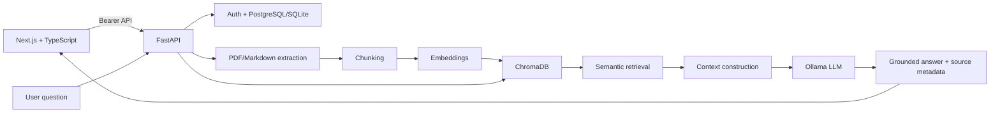

<<<<<<< HEAD
# ContextIQ — Context-Aware AI Document Assistant

**Your Documents. Your Context. Intelligent Answers.**

ContextIQ is a portfolio-ready RAG application for asking grounded questions about PDFs and Markdown files. It extracts source text, creates semantic chunks, embeds them into ChromaDB, retrieves relevant passages, sends only retrieved context to an LLM, and returns source-aware answers with page/section navigation.

## Problem

Generic chatbots can answer confidently without showing where information came from. ContextIQ is designed around traceability: every answer is grounded in retrieved document chunks and the UI exposes the exact source metadata returned by the backend.

## Features

- Real account registration/login with password hashing and bearer sessions
- User-scoped documents, vectors, conversations and messages
- PDF and Markdown upload with size/type validation and progress
- Real text extraction, chunking, embeddings and ChromaDB indexing
- Semantic retrieval constrained by document + user ID
- Ollama-backed grounded RAG chat with streaming SSE responses
- Backend-generated citations; no frontend-generated fake page numbers
- PDF viewer with page navigation, zoom, search action and fullscreen
- Markdown section citations and safe escaped rendering
- Persistent conversations, automatic titles, search, rename and delete
- Global document search, rename, download and delete
- Settings, storage dashboard, password change and logout-all-sessions
- Friendly empty/loading/error states
- Request IDs, structured logging, CORS configuration and rate-limit preparation
- Dockerfiles, Compose and FastAPI OpenAPI/Swagger

## Architecture



## RAG workflow

`Document → Text Extraction → Chunking → Embeddings → ChromaDB → Semantic Retrieval → Context Construction → LLM → Grounded Answer → Source Citation → Document Navigation`

Retrieved document content is explicitly treated as **untrusted data** in the LLM prompt so instructions embedded in uploaded documents are not treated as system commands.

## Stack

**Frontend:** Next.js 16, React, TypeScript, Tailwind CSS, Lucide

**Backend:** Python 3.12, FastAPI, SQLAlchemy, LangChain, pypdf

**AI/Data:** sentence-transformers embeddings, ChromaDB, Ollama

**Storage:** SQLite by default; PostgreSQL-compatible SQLAlchemy configuration
=======
# ContextIQ — Day 3

ContextIQ is a context-aware AI document assistant built incrementally across a 7-day plan.

## Included in this Day 3 package

Day 3 extends the Day 1 + Day 2 codebase without removing authentication UI or the existing landing page.

### Document management
- PDF, `.md`, and `.markdown` uploads
- Configurable maximum upload size
- Drag-and-drop and browse
- Upload progress using `XMLHttpRequest`
- Client-side file type/size validation
- Cancel, retry, success and error states
- Documents page with search, type filter and sort
- Upload date, size and processing status
- Open, Chat and Delete actions
- Delete confirmation

### Viewer preparation
- `/documents/[id]` two-pane document viewer
- PDF preview through the FastAPI content endpoint
- Safe Markdown rendering with headings, lists, tables, code blocks, links and blockquotes
- Chat placeholder on the right
- Layout leaves room for future page/anchor citation navigation

### FastAPI preparation
Implemented:
- `POST /api/documents/upload`
- `GET /api/documents`
- `GET /api/documents/{id}`
- `DELETE /api/documents/{id}`
- `GET /api/documents/{id}/content`
- `PATCH /api/documents/{id}/status` for development/testing of lifecycle states
- `GET /health`

The Day 3 backend deliberately stops at durable upload. It returns `Uploaded` and does **not** claim extraction, chunking, embeddings, vector indexing, or `Ready` until those systems actually exist.

The deletion model uses a stable `document_id` and a single delete boundary so future stores can cascade:
1. original document
2. extracted text
3. embeddings
4. Chroma/vector records
5. document-specific chat history
>>>>>>> 96caef8b5731e0359bc665a7d85c03e5a003a67a

## Project structure

```text
<<<<<<< HEAD
ContextIQ/
├── app/                 # Next.js pages
├── components/          # Workspace, upload, viewer and chat UI
├── lib/                 # API/auth/document helpers
├── public/              # Favicon/logo
├── backend/
│   ├── app/
│   │   ├── routers/     # auth, documents, chat
│   │   ├── services/    # parsing, RAG, LLM
│   │   ├── models.py
│   │   └── main.py
│   ├── storage/         # runtime files (ignored by Git)
│   └── requirements.txt
├── Dockerfile
├── docker-compose.yml
└── README.md
```

## Installation

### 1. Frontend

```bash
npm install
copy .env.example .env.local
npm run dev
```

Open `http://localhost:3000`.

### 2. Backend

```cmd
cd backend
py -3.12 -m venv .venv
.venv\Scripts\activate
pip install -r requirements.txt
copy .env.example .env
python run.py
```

FastAPI docs: `http://localhost:8000/docs`

Health: `http://localhost:8000/health`

### 3. Ollama

Install Ollama separately and pull a local model:

```bash
ollama pull llama3.2:3b
```

Keep Ollama running before asking ContextIQ questions.

## Environment variables

Backend:

```text
DATABASE_URL=sqlite:///./contextiq.db
UPLOAD_DIR=./storage/uploads
CHROMA_PERSIST_DIRECTORY=./storage/chroma
MAX_UPLOAD_MB=20
CORS_ORIGINS=http://localhost:3000
AUTH_SECRET=replace-with-a-long-random-secret
LLM_PROVIDER=ollama
LLM_BASE_URL=http://localhost:11434
LLM_MODEL=llama3.2:3b
EMBEDDING_MODEL=sentence-transformers/all-MiniLM-L6-v2
OPENAI_API_KEY=
GOOGLE_CLIENT_ID=
GOOGLE_CLIENT_SECRET=
CHROMA_HOST=
CHROMA_PORT=
```

Frontend:

```text
NEXT_PUBLIC_API_BASE_URL=http://localhost:8000
NEXT_PUBLIC_MAX_UPLOAD_MB=20
```

Never commit real secrets.

## API endpoints

| Method | Endpoint | Purpose |
|---|---|---|
| POST | `/api/auth/register` | Create account |
| POST | `/api/auth/login` | Authenticate |
| GET | `/api/auth/me` | Current user |
| POST | `/api/auth/change-password` | Change password |
| POST | `/api/auth/logout-all` | Invalidate sessions |
| POST | `/api/documents/upload` | Upload + index |
| GET | `/api/documents` | List own documents |
| GET | `/api/documents/{id}` | Document metadata |
| GET | `/api/documents/{id}/content` | Markdown content |
| GET | `/api/documents/{id}/download` | Download source |
| PATCH | `/api/documents/{id}` | Rename |
| DELETE | `/api/documents/{id}` | Delete file/chunks/vectors/chats |
| GET | `/api/documents/{id}/suggestions` | Source-aware suggestions |
| POST | `/api/chat` | Non-streaming chat |
| POST | `/api/chat/stream` | SSE streaming chat |
| GET | `/api/conversations` | History |
| GET | `/api/conversations/{id}` | Conversation + messages |
| PATCH | `/api/conversations/{id}` | Rename |
| DELETE | `/api/conversations/{id}` | Delete |
| GET | `/health` | Service health |

## Docker

```bash
copy backend\.env.example backend\.env
docker compose up --build
```

The frontend is available on port 3000 and FastAPI on port 8000. For production, put a reverse proxy/TLS layer in front and use managed PostgreSQL plus a production vector service where appropriate.

## Security considerations

- All document/conversation/vector access is scoped to the authenticated user.
- Passwords are PBKDF2-SHA256 hashed; plaintext passwords are never stored.
- Upload paths use generated UUID filenames rather than user-controlled paths.
- File type and size are validated server-side.
- Markdown output is escaped before HTML rendering.
- Retrieved content is marked untrusted in the prompt to reduce prompt-injection risk.
- Backend errors avoid returning stack traces.
- CORS is configurable.
- In-memory request rate limiting is included as preparation; use a shared Redis-backed limiter for multi-instance production.
- Use a strong random `AUTH_SECRET` in production.

## Screenshots

Add screenshots here after deployment:

```text
screenshots/
├── landing.png
├── dashboard.png
├── document-viewer.png
├── chat-citations.png
└── chat-history.png
```

## Future improvements

- Managed PostgreSQL + migrations with Alembic
- Pinecone/managed Chroma for scalable vector storage
- Redis rate limiting and background job queue
- True Google OAuth callback flow and transactional password-reset email
- Better PDF text highlighting using PDF.js text-layer coordinates
- Token streaming through a production reverse proxy
- Observability with OpenTelemetry and centralized logs
- Multi-document chat and workspace sharing
=======
ContextIQ-Day3/
├── app/
│   ├── auth/                 # Day 2 authentication UI
│   ├── dashboard/
│   ├── documents/
│   │   └── [id]/
│   └── page.tsx              # Day 1 landing page
├── backend/
│   ├── main.py
│   ├── requirements.txt
│   └── .env.example
├── components/
│   ├── auth.tsx
│   ├── document-list.tsx
│   ├── document-upload.tsx
│   ├── document-viewer-client.tsx
│   ├── markdown-viewer.tsx
│   └── workspace-shell.tsx
└── lib/
    └── documents.ts
```

## Run frontend

From the project root:

```bash
npm install
npm run dev
```

Frontend: `http://localhost:3000`

Copy `.env.example` to `.env.local` and adjust:

```env
NEXT_PUBLIC_API_BASE_URL=http://localhost:8000
NEXT_PUBLIC_MAX_UPLOAD_BYTES=26214400
```

`NEXT_PUBLIC_MAX_UPLOAD_BYTES` is the browser validation limit. The backend has its own authoritative limit.

## Run FastAPI

From the project root:

```bash
python -m venv .venv
```

Windows:

```bash
.venv\Scripts\activate
```

macOS/Linux:

```bash
source .venv/bin/activate
```

Then:

```bash
pip install -r backend/requirements.txt
uvicorn backend.main:app --reload --port 8000
```

Optional backend environment:

```env
MAX_UPLOAD_BYTES=26214400
DOCUMENT_STORAGE_DIR=./backend/storage
CORS_ORIGINS=http://localhost:3000
```

The storage directory is intentionally ignored by Git.

## Important Day 3 processing boundary

An uploaded file is stored and reported as:

`Uploaded`

It is **not** automatically changed to:

`Processing` → `Ready`

because Day 3 does not yet have the real parser/chunking/embedding/RAG pipeline. This prevents the UI from misleading users.

The status model already supports:

`Uploading | Uploaded | Processing | Ready | Failed`

## Seven-day architecture

```text
Frontend
Next.js / React
      │
      │ REST API / SSE
      ▼
FastAPI Backend
      │
      ├── PDF / Markdown Parser       ← next stage
      ├── Text Chunking               ← next stage
      ├── Embedding Generation       ← next stage
      ├── RAG Retrieval              ← next stage
      ├── LLM                        ← next stage
      └── Citation Generator         ← next stage
      │
      ├───────────────┐
      ▼               ▼
ChromaDB        Metadata Database
Vectors         Users/Documents/Chats
```

## Day 1 + Day 2 preserved

The landing page, responsive UI, reusable components, authentication screens, password policy and protected-route architecture remain in the project. Day 3 adds the document layer rather than replacing those features.
>>>>>>> 96caef8b5731e0359bc665a7d85c03e5a003a67a
